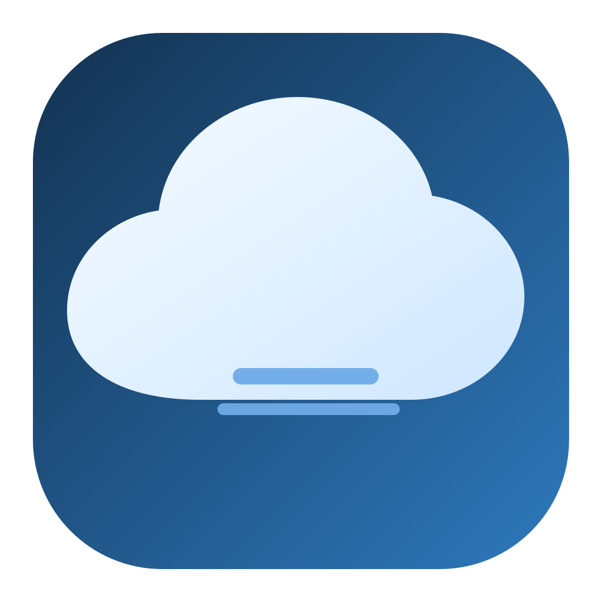
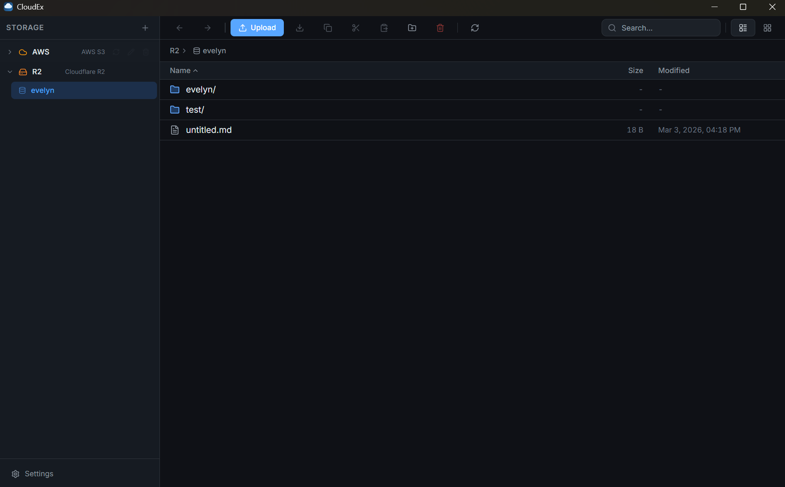
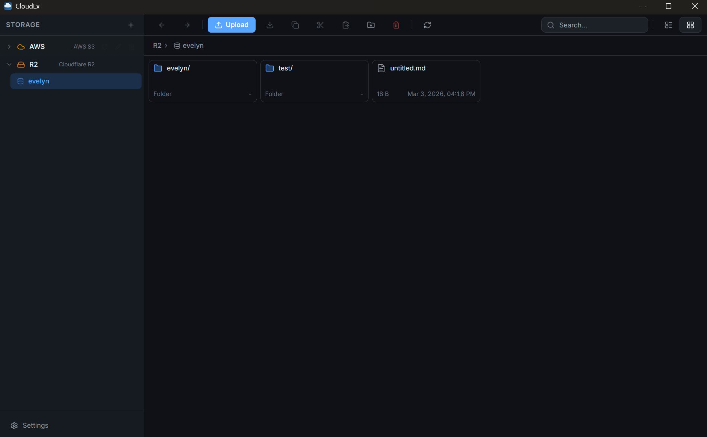
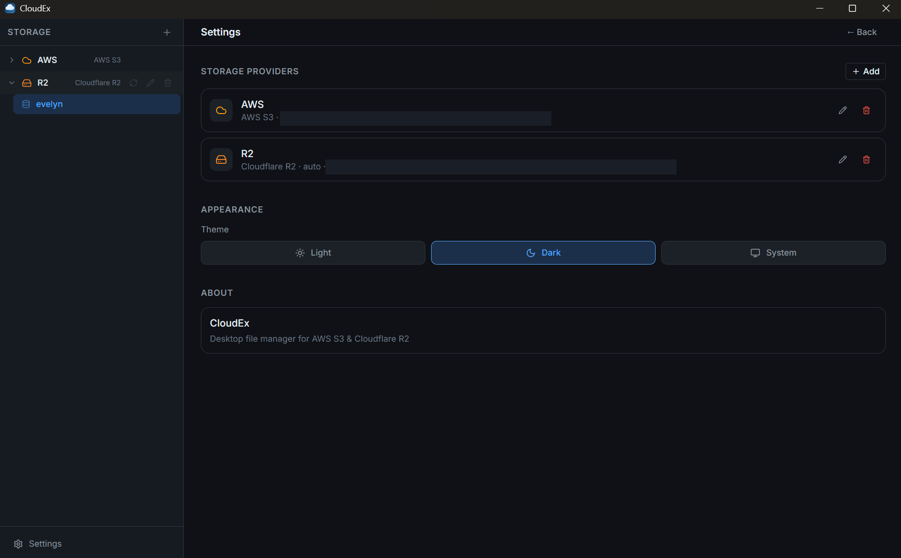
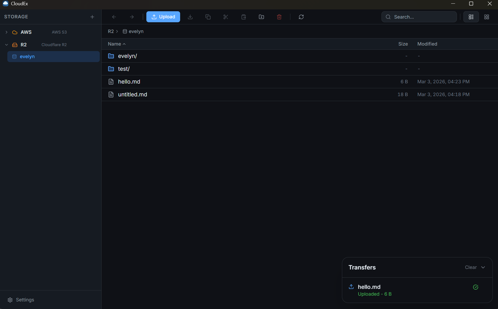

<p align="center">
  
</p>
<h1 align="center">CloudEx</h1>
<p align="center">
       
</p>

CloudEx is a desktop file manager for S3-compatible object storage, focused on AWS S3 and Cloudflare R2.

It is built with Electron, React, TypeScript, Zustand, and the AWS SDK v3.

## Highlights

- Multi-connection support for AWS S3 and Cloudflare R2
- Bucket and object browsing with search, pagination, and auto load more
- List and grid views
- Upload and download with transfer progress
- Drag and drop file upload
- Drag items onto folders to move them
- Folder upload support
- Copy, cut, paste, rename, delete, and create folder
- Multi-select operations and bulk download (zip)
- Windows-style click-drag rectangle multi-select
- Clipboard panel with expandable item list and in-progress operation indicator
- Presigned URL generation with configurable expiration
- Context menus and keyboard shortcuts
- Light/dark theme support
- Local encrypted storage for connection settings (`electron-store`)

## Screenshots

### Main List View


### Main Grid View


### Settings and Connections


### Transfer Queue


## Tech Stack

- Electron + electron-vite
- React 19 + TypeScript
- Zustand state management
- Tailwind CSS + Radix UI primitives
- AWS SDK v3 (`@aws-sdk/client-s3`, `@aws-sdk/lib-storage`, presigner)

## Requirements

- Node.js 20+ (Node.js 22 LTS recommended)
- npm 10+
- Windows, macOS, or Linux

## Quick Start

```bash
npm install
npm run dev
```

## Scripts

- `npm run dev`: Start local development app (Electron + Vite)
- `npm run build`: Build main, preload, and renderer output into `out/`
- `npm run typecheck`: Type-check renderer and Electron code
- `npm run preview`: Preview built renderer
- `npm run dist`: Build and package for current platform
- `npm run dist:win`: Build and package Windows artifacts
- `npm run dist:mac`: Build and package macOS artifacts
- `npm run dist:linux`: Build and package Linux artifacts
- `npm run build:win`: Alias of `dist:win`
- `npm run build:mac`: Alias of `dist:mac`
- `npm run build:linux`: Alias of `dist:linux`

## Keyboard Shortcuts

- `Ctrl/Cmd + A`: Select all
- `Ctrl/Cmd + C`: Copy selected items
- `Ctrl/Cmd + X`: Cut selected items
- `Ctrl/Cmd + V`: Paste clipboard items
- `Delete` or `Backspace`: Delete selected items
- `Ctrl/Cmd + D`: Delete selected items
- `F5` or `Ctrl/Cmd + R`: Refresh current folder
- `Escape`: Clear current selection
- `Shift + Click`: Select range
- `Ctrl/Cmd + Click`: Toggle item selection

## Packaging Output

Packaged artifacts are generated in:

- `release/`

Configured targets:

- Windows: NSIS installer
- macOS: DMG
- Linux: default electron-builder Linux target

## AWS/R2 Permissions

CloudEx can work in two access modes:

1. Bucket-scoped mode (recommended): configure a specific bucket in the provider settings.
   In this mode, bucket listing is not required for normal browsing/operations.
2. Account-wide mode: allows listing buckets.

Minimum permissions depend on features you use. Typical permissions include:

- `s3:ListBucket`
- `s3:GetObject`
- `s3:PutObject`
- `s3:DeleteObject`
- `s3:CopyObject`

Only grant `s3:ListAllMyBuckets` if you need global bucket listing.

## Project Structure

```text
electron/
  main/       # App lifecycle, window, IPC handlers, providers
  preload/    # contextBridge API for renderer
src/
  components/ # UI and feature components
  store/      # Zustand stores
  lib/        # Utilities
  types/      # Shared renderer types
build/
  icon assets
```

## Security Notes

- Provider credentials are stored locally via `electron-store`.
- Storage API operations are performed in Electron main process (not renderer).
- Do not commit local secrets, config exports, or packaged credentials.

## Troubleshooting

- Icon changes not visible in dev:
  fully close and restart `npm run dev`.
- AccessDenied on bucket listing:
  use bucket-scoped mode or grant `s3:ListAllMyBuckets` if account-wide listing is required.
- Packaging issues:
  run `npm run build` first, then run a `dist:*` script.

## License

MIT
